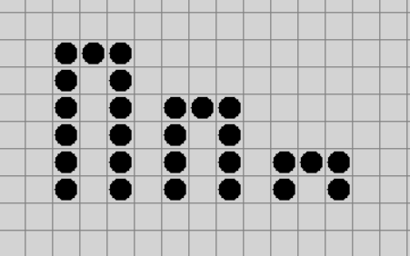
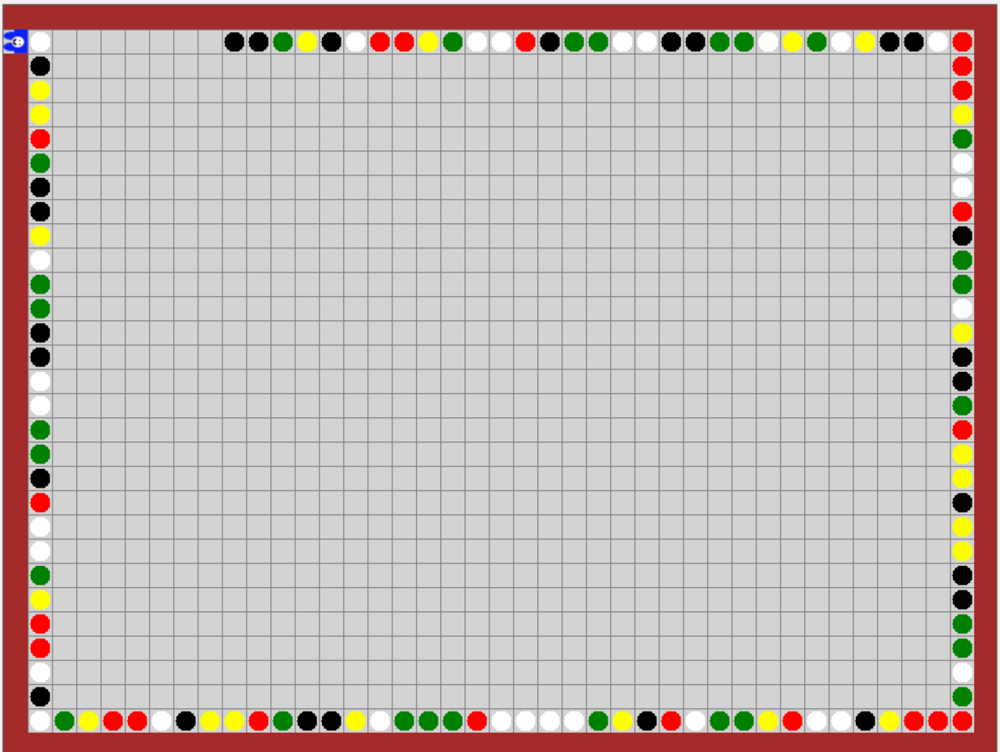

# Dolgozat 03. 01.

# 1. feladat: Várfal

1. Készíts eljárást, ami lerajzolja egy bástya körvonalát! A bástya magassága megadható legyen paraméterrel. A lentebbi képen láthatod a `bástya(6)`, `bástya(4)` és `bástya(2)` által generált rajzokat.

2. Készítsd el a `várfal` eljárást, amelynek első paraméterül meg tudjuk adni, hogy hány bástyából áll, a második paraméterrel pedig meg lehet adni, hogy milyen magas legyen! 

3. Minden páros sorszámú bástya kettővel kisebb legyen, mint a páratlanok! A képen a `várfal(6,4)` eljárás által generált ábrát látjátok. (Segítség: azt, hogy páros-e egy szám maradékos osztással tudod ellenőrizni, ennek a jele: % /modulo/. Például, egy `i` nevű változóban akkor páros, ha az `i % 2 == 0` kifejezés igazzal tér vissza, tehát kettővel osztható.)

# 2. feladat: Kiút keresés az útvonal rajzolásával
    pálya02.txt-pálya07.txt

Készíts eljárást, amelyik kijut a 2,3,4,5,6,7-es pályáról is! Karesz amint falhoz ér, kezdjen el véletlenszerű színű kavicsot lerakni, és így járja körbe a pályát, egészen addig, amíg kijáratot nem talál.

# 3. feladat: Kert takarítás, virágültetés
    pálya29.txt

1. A kertben lévő szemeteket piros és fekete színekkel jelöltük. Ezeket vedd le a pályáról!
2. Sárga színnel jelöltük a virágok helyét. Ezek köré rajzolj ilyen virágot! Csak egyszer menj körbe a pályán.

